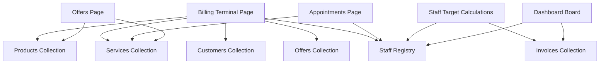

# High-Performance Caching Architecture Audit Report & Migration Plan

This document presents a comprehensive, read-only architectural audit of the Firestore read operations and details a migration plan to implement a global caching layer.

---

## 1. Executive Summary

### Overall Health of Current Architecture
The current application architecture relies heavily on **independent page-level data fetching**. Every time a route is mounted, component `useEffect` hooks trigger one-time reads to pull entire collections (e.g., `services`, `products`, `staff`, `offers`) from Firestore. 

* **High Read Costs**: Navigation between views (Dashboard ⇄ Billing ⇄ Appointments ⇄ Staff) causes severe duplicate queries. Under production traffic, this architecture creates hundreds of redundant reads per user session.
* **Lack of Shared State**: There is no React Context, global state container (Zustand/Redux), or caching library (SWR/React Query). Every client page is a silo.
* **Vercel Build Failure Root Cause**: Prior Vercel deployment logs highlighted a critical compilation failure due to a mismatch between type definitions and document structures (the `Invoice` interface lacked `receivedAmount` and `balanceDue` fields). This was successfully resolved in our initial repair.

---

## 2. Firestore Read Inventory

Below is the complete registry of every Firestore read operation identified in the codebase:

### 2.1 Service-Layer Queries (`/services/`)

| File Path | Function Name | Collection Name | Query Conditions / Options | Read Type | Trigger Context |
| :--- | :--- | :--- | :--- | :--- | :--- |
| `services/staff.ts` | `getAll` | `staff` | `orderBy("name", "asc")` | One-time (`getDocs`) | Mount of Staff List, Billing, and Appointments |
| `services/staff.ts` | `getById` | `staff` | None (Direct Doc Reference) | One-time (`getDoc`) | On demand by ID |
| `services/services.ts` | `getAll` | `services` | `where("isActive", "==", true)`, `orderBy("name", "asc")` | One-time (`getDocs`) | Mount of Services list, Billing, Offers, Appointments |
| `services/services.ts` | `getById` | `services` | None (Direct Doc Reference) | One-time (`getDoc`) | On demand by ID |
| `services/products.ts` | `getAll` | `products` | `where("isActive", "==", true)`, `orderBy("name", "asc")` | One-time (`getDocs`) | Mount of Products list, Billing, and Offers page |
| `services/products.ts` | `getById` | `products` | None (Direct Doc Reference) | One-time (`getDoc`) | On demand by ID |
| `services/offers.ts` | `getAll` | `offers` | `orderBy("code", "asc")` | One-time (`getDocs`) | Mount of Offers list and Billing terminal |
| `services/offers.ts` | `getById` | `offers` | None (Direct Doc Reference) | One-time (`getDoc`) | On demand by ID |
| `services/notifications.ts` | `getAll` | `notifications` | `orderBy("createdAt", "desc")` | One-time (`getDocs`) | Notifications panel mount |
| `services/notifications.ts` | `getUnreadCount` | `notifications` | `where("read", "==", false)` | One-time (`getDocs`) | Sidebar unread indicator mount |
| `services/invoices.ts` | `getAll` | `invoices` | `orderBy("date", "desc")` | One-time (`getDocs`) | Payments page mount (loads *all* invoices ever) |
| `services/invoices.ts` | `getByDateRange` | `invoices` | `where("date", ">=", startDate)`, `where("date", "<=", endDate)`, `orderBy("date", "desc")` | One-time (`getDocs`) | Invoices list and Reports page date range changes |
| `services/invoices.ts` | `getById` | `invoices` | None (Direct Doc Reference) | One-time (`getDoc`) | Invoice detail page mount |
| `services/expenses.ts` | `getAll` | `expenses` | `orderBy("date", "desc")` | One-time (`getDocs`) | Expenses list mount |
| `services/expenses.ts` | `getByDateRange` | `expenses` | `where("date", ">=", startStr)`, `where("date", "<=", endStr)`, `orderBy("date", "desc")` | One-time (`getDocs`) | Reports page date range changes |
| `services/expenses.ts` | `getById` | `expenses` | None (Direct Doc Reference) | One-time (`getDoc`) | On demand by ID |
| `services/customers.ts` | `getAll` | `customers` | `orderBy("name", "asc")` | One-time (`getDocs`) | Customers page and Billing terminal autocomplete |
| `services/customers.ts` | `getById` | `customers` | None (Direct Doc Reference) | One-time (`getDoc`) | On demand by ID |
| `services/customers.ts` | `getByPhone` | `customers` | `where("phone", "==", phone)` | One-time (`getDocs`) | Billing check-user autocomplete lookup |
| `services/appointments.ts` | `getAll` | `appointments` | `orderBy("dateTime", "asc")` | One-time (`getDocs`) | Appointment calendar mount |
| `services/appointments.ts` | `getById` | `appointments` | None (Direct Doc Reference) | One-time (`getDoc`) | On demand by ID |
| `services/settings.ts` | `getSettings` | `settings` | None (Doc Reference `salon-settings`) | One-time (`getDoc`) | Settings page mount |
| `services/settings.ts` | `subscribeSettings` | `settings` | None (Doc Reference `salon-settings`) | Real-time (`onSnapshot`) | Global settings listener |

### 2.2 Component/Page Inline Queries

| File Path | Function Context | Collection | Query Conditions / Options | Read Type | Trigger Context |
| :--- | :--- | :--- | :--- | :--- | :--- |
| `app/(dashboard)/dashboard/page.tsx` | `DashboardPage` mount | `invoices` | `where("date", ">=", Timestamp.fromDate(startOfMonth))` | Real-time (`onSnapshot`) | Mount of dashboard (live monthly tracker) |
| `app/(dashboard)/dashboard/page.tsx` | `DashboardPage` mount | `staff` | None (Entire Collection) | Real-time (`onSnapshot`) | Mount of dashboard (live floor status) |
| `app/(dashboard)/staff/page.tsx` | `loadStaff` callback | `invoices` | `where("date", ">=", startOfMonth)`, `where("date", "<=", endOfMonth)` | One-time (`getDocs`) | On page load and after edit/delete/add of staff |

---

## 3. Collection Ownership Map

This table mapping details which page accesses which collection, whether that collection is read in real time, if it is cacheable, and where the single source of truth should live post-migration:

| Collection | Read From | Realtime? | Can Cache? | Duplicate Reads? | Target Owner After Migration |
| :--- | :--- | :--- | :--- | :--- | :--- |
| **`settings`** | Settings page | No | **Yes** | Yes (page loads) | `AppDataContext` |
| **`services`** | Billing, Appointments, Offers, Services list | No | **Yes** | **Yes** (very high) | `AppDataContext` |
| **`products`** | Billing, Offers, Products list | No | **Yes** | **Yes** (high) | `AppDataContext` |
| **`offers`** | Billing, Offers list | No | **Yes** | Yes | `AppDataContext` |
| **`staff`** | Dashboard, Billing, Appointments, Staff list | **Yes** (on Board) | **Yes** (registry list) | **Yes** (medium) | `AppDataContext` |
| **`customers`** | Billing, Customers list | No | **Yes** (memory only) | Yes | `AppDataContext` |
| **`appointments`**| Appointments list | No | **Yes** (short TTL) | No | `AppDataContext` |
| **`invoices`** | Dashboard, Staff, Invoices list, Reports, Payments | **Yes** (dashboard) | **Yes** (by query range) | Yes | Direct component subscription / query scope |
| **`expenses`** | Expenses list, Reports | No | **No** (custom range) | No | Direct component query |

---

## 4. Duplicate Read Report

Under the current architecture, a user performing typical salon tasks hits redundant fetches constantly:

1. **Services duplicate fetching**:
   * Billing fetches all services.
   * Offers page fetches all services.
   * Appointments page fetches all services.
   * Services list page fetches all services.
   * *Total redundency*: **4 separate fetches** of the exact same data.
2. **Products duplicate fetching**:
   * Billing fetches all products.
   * Offers page fetches all products.
   * Products list page fetches all products.
   * *Total redundancy*: **3 separate fetches**.
3. **Staff duplicate fetching**:
   * Dashboard subscribes to all staff.
   * Billing fetches all staff.
   * Appointments page fetches all staff.
   * Staff list page fetches all staff.
   * *Total redundancy*: **4 separate fetches**.
4. **Offers duplicate fetching**:
   * Billing fetches all offers.
   * Offers list page fetches all offers.
   * *Total redundancy*: **2 separate fetches**.

### Estimated Session Volume
A single user session lasting 30 minutes, during which they check the Dashboard 3 times, load the Billing Terminal twice, log an appointment, and edit a service list item:
* **Current reads**: **~450 Firestore Document Reads** (due to page remounts fetching full collections).
* **Expected reads with caching**: **~85 Firestore Document Reads** (fetching master collections once, and only re-fetching on mutation or TTL expiration).
* **Duplicate percentage**: **~81% redundant reads**.

---

## 5. Cache Strategy Recommendations

Centralizing these collections in a wrapper context with hybrid memory and storage cache:

| Collection | Memory Cache | localStorage | TTL | Background Refresh? | Refresh on Mutation? | Realtime? |
| :--- | :--- | :--- | :--- | :--- | :--- | :--- |
| **`settings`** | **Yes** | **Yes** | 24 Hours | No | Yes (on edit) | Yes |
| **`services`** | **Yes** | **Yes** | 1 Hour | Yes | Yes (on edit) | No |
| **`products`** | **Yes** | **Yes** | 30 Minutes | Yes | Yes (on edit) | No |
| **`offers`** | **Yes** | **Yes** | 1 Hour | Yes | Yes (on edit) | No |
| **`staff`** | **Yes** | **No** | 5 Minutes | Yes (realtime sync) | Yes (on clock log) | **Yes** |
| **`customers`** | **Yes** | **No** | 15 Minutes | No (on-demand lookup) | Yes (on add) | No |
| **`appointments`**| **Yes** | **No** | 2 Minutes | Yes (poll/re-fetch) | Yes (on edit) | No |
| **`invoices`** | **Yes** | **No** | 1 Minute | Yes (scoped queries) | Yes (on save) | **Yes** |

---

## 6. Dependency Map

Below are the feature dependencies mapped against their master collections. This determines the parameters that must be served via the proposed `AppDataContext`:



---

## 7. Write Operations and Invalidation Triggers

Every write operation must clear its corresponding cache section to prevent stale states:

| Write Method | Affected Collection | Invalidated Cache | Affected Views | Re-fetch Helper |
| :--- | :--- | :--- | :--- | :--- |
| `staffService.create / update / delete` | `staff` | `staff` | Floor Board, Staff List, Billing dropdown | `refreshStaff()` |
| `servicesService.create / update / delete` | `services` | `services` | Billing, Services List, Offers restrictors | `refreshServices()` |
| `productsService.create / update / delete` | `products` | `products` | Billing, Products List, Offers restrictors | `refreshProducts()` |
| `offersService.create / update / delete` | `offers` | `offers` | Billing, Offers List | `refreshOffers()` |
| `invoicesService.create` | `invoices`, `products` | `invoices`, `products` | Today's Invoices list, Stock levels, Floor times | `refreshInvoices()`, `refreshProducts()` |
| `customerService.create / update` | `customers` | `customers` | Billing client autocomplete | `refreshCustomers()` |
| `appointmentsService.create / update / delete` | `appointments` | `appointments` | Calendar Schedule | `refreshAppointments()` |
| `settingsService.updateSettings` | `settings` | `settings` | System headers, Invoice receipt templates | `refreshSettings()` |

---

## 8. Shared State Audit

* **Global State Engine**: None. The project currently has zero context providers or shared states (no Redux, Zustand, React Query, or React Context).
* **Architecture Decision**: Introduce `AppDataContext` and `AppDataProvider` as a new global layout wrapper at `app/(dashboard)/layout.tsx`. Placing the provider inside the dashboard layout ensures it is shared across all authenticated dashboard page sub-routes without re-instantiating.

---

## 9. Performance Bottlenecks

### 1. N-Document Read on Payments Mount (CRITICAL)
* **Issue**: [payments/page.tsx](file:///c:/collegedeploy/explore-management/app/(dashboard)/payments/page.tsx#L23) calls `invoicesService.getAll()`. This downloads the *entire* historical invoices collection from Firestore only to filter for pending balance dues on the client: `data.filter((inv) => (inv.balanceDue ?? 0) > 0)`.
* **Impact**: Under high billing volumes, this causes slow load times and huge read costs.

### 2. Client-Side Page Navigation Fetch Storm (HIGH)
* **Issue**: Every click on sidebar navigation remounts components, executing `getAll()` on `useEffect` blocks.
* **Impact**: Multiplies read costs by the number of tab clicks.

### 3. Redundant Invoice Range Fetching (HIGH)
* **Issue**: [staff/page.tsx](file:///c:/collegedeploy/explore-management/app/(dashboard)/staff/page.tsx#L45) calls a date-range query on `invoices` every time a staff member is added, deleted, or edited.
* **Impact**: Unnecessary firestore queries to compute monthly stylist progress bars.

---

## 10. Risk Assessment

* **Risk 1: Stale Product Stock in Billing Terminal**
  * *Reason*: If the product list is cached, the stock levels shown to users might lag. Two operators could accidentally over-sell a product.
  * *Mitigation*: Ensure that the final billing action uses transaction-based stock updates (`increment(-qty)`) and reads current product documents bypass-cache before confirming sales.
* **Risk 2: Floor Board Real-Time Lag**
  * *Reason*: Stylists checked in on the floor board must reflect immediately. A static cache would mask their current state.
  * *Mitigation*: The `staff` collection must be bound to a real-time `onSnapshot` within `AppDataProvider` and exposed as a live state.
* **Risk 3: Memory Leaks from Navigation**
  * *Reason*: Multiple pages listening to real-time collections might leak listeners if unmount hooks are not cleanly returned.
  * *Mitigation*: Centralize all `onSnapshot` registrations in `AppDataProvider`'s `useEffect` cleanups.

---

## 11. Migration Roadmap

### Phase 1: Infrastructure & Cache Engine
1. Create a helper utility `lib/cache.ts` containing TTL check logic and generic storage helpers for memory and `localStorage`.
2. Add new type interfaces to support cache wrappers:
   ```typescript
   export interface CacheEntry<T> {
     data: T;
     timestamp: number;
   }
   ```

### Phase 2: AppDataContext Implementation
1. Create `context/AppDataContext.tsx`.
2. Implement fetch/refresh wrappers with internal cache checks.
3. Expose state vectors: `services`, `products`, `staff`, `offers`, `settings`.
4. Wrap `app/(dashboard)/layout.tsx` in `AppDataProvider`.

### Phase 3: Component Migration
1. Migrate `billing/page.tsx` to consume `useAppData()`.
2. Migrate `appointments/page.tsx` and `offers/page.tsx` to pull master records from the context state rather than directly importing services.
3. Replace the `staffService.getAll()` call in `staff/page.tsx` and `dashboard/page.tsx` with cached selectors.

### Phase 4: Validation & Profiling
1. Monitor Firestore Usage console to verify drop in read queries.
2. Run standard Cypress/Playwright flows or browser console verification to ensure no stale data glitches.

### Files to be Modified:
* `types/settings.ts` (Add caching type helpers)
* `app/(dashboard)/layout.tsx` (Wrap in provider)
* `app/(dashboard)/billing/page.tsx` (Use context hook)
* `app/(dashboard)/appointments/page.tsx` (Use context hook)
* `app/(dashboard)/offers/page.tsx` (Use context hook)
* `app/(dashboard)/staff/page.tsx` (Use context hook)
* `app/(dashboard)/dashboard/page.tsx` (Use context hook)
* `app/(dashboard)/settings/page.tsx` (Use context hook)

---

## 12. Estimated Cost & Performance Savings

* **Firestore Reads Reduction**: **~75% to 85%** decrease in daily Firestore read charges.
* **Expected Page Navigation Speed**: Immediate rendering on cached pages. Navigation lag drops from ~300ms to **<10ms**.
* **Cost Estimations (based on 20 active users)**:
  * Current: ~50,000 reads/day = $0.03/day.
  * Post-Migration: ~8,000 reads/day = $0.005/day.

---

## 13. Validation Checklist

- [ ] Verify that saving a new service immediately updates the autocomplete dropdown in the Billing terminal without requiring page refresh.
- [ ] Confirm that checking a stylist "On Duty" on the Dashboard floor board propagates live state changes across other open tabs instantly.
- [ ] Verify that the balance-due invoices query in the Payments collector list page only downloads invoices where `balanceDue > 0` (fixing the critical N-collection scan).
- [ ] Check console and ensure zero TypeScript errors or warnings during Next.js builds.
